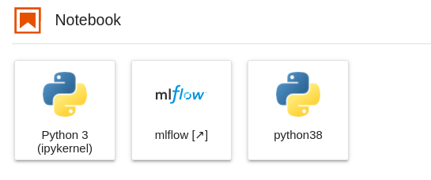
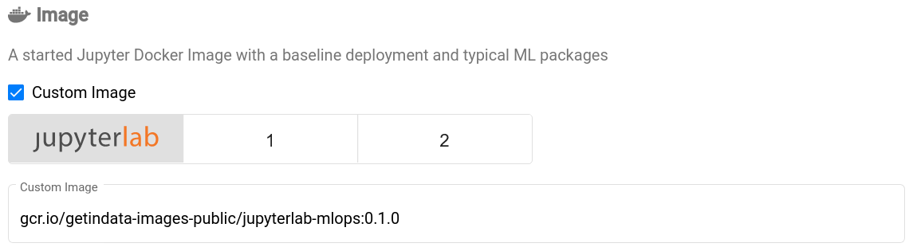
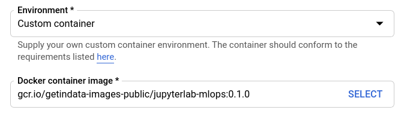

# Jupyter Images 

This repository stores receipes of publicly-available Jupyter images

Latest versions:

```
gcr.io/getindata-images-public/jupyterlab-mlops:dev-0.2.9
```

## jupyterlab-base

Local copy of [jupyter/base-notebook](https://jupyter-docker-stacks.readthedocs.io/en/latest/using/selecting.html#jupyter-base-notebook), 
used to build and manage local versions of `base-notebook` image that are no longer published in offical repositories:

### jupyterlab-base:ubuntu-20.04.python-3.8

* conda-backed python 3.8.x environment
* Ubuntu 20.04 as base image

## jupyterlab-mlops

Based on the [jupyter/pyspark-notebook](https://jupyter-docker-stacks.readthedocs.io/en/latest/using/selecting.html#jupyter-pyspark-notebook)
image with additional setup of:

* conda-backed python 3.9 environment
* [jupyterlab-git](https://github.com/jupyterlab/jupyterlab-git) extension
* local [MLflow](https://mlflow.org/) server for experiment tracking
* additional conda environment with python 3.8 and [kedro](https://kedro.readthedocs.io/en/stable/) framework
* Istio-compatible Spark executor entrypoint



Compatibility:

- [x] [Kubeflow Notebook Servers](https://www.kubeflow.org/docs/components/notebooks/)
- [x] [Vertex AI Notebooks](https://cloud.google.com/vertex-ai/docs/general/notebooks)

## jupyterlab-dataops

Based on the [jupyter/base-notebook](https://jupyter-docker-stacks.readthedocs.io/en/latest/using/selecting.html#jupyter-base-notebook)
image with additional setup:

* conda-backed python 3.8.8 environment
* [jupyterlab-git](https://github.com/jupyterlab/jupyterlab-git) extension
* [jupyter-server-proxy](https://jupyter-server-proxy.readthedocs.io) extension
* local [code-server](https://github.com/coder/code-server) as IDE accessed from the browser with
[dbt Power User](https://marketplace.visualstudio.com/items?itemName=innoverio.vscode-dbt-power-user) extension pre-installed
* local [CloudBeaver](https://github.com/dbeaver/cloudbeaver) as SQL editor accessed from the browser
* [dbt](https://docs.getdbt.com/) CLI

Compatibility:

- [x] [JupyterHub](https://jupyter.org/hub)
- [x] [Vertex AI Notebooks](https://cloud.google.com/vertex-ai/docs/general/notebooks)

## jupyterlab-streaming

Based on the [jupyter/base-notebook](https://jupyter-docker-stacks.readthedocs.io/en/latest/using/selecting.html#jupyter-base-notebook)
image with additional setup:

* conda-backed python 3.8.8 environment
* [jupyterlab-git](https://github.com/jupyterlab/jupyterlab-git) extension
* [jupyter-server-proxy](https://jupyter-server-proxy.readthedocs.io) extension
* [streaming-jupyter-integrations](https://github.com/getindata/streaming-jupyter-integrations) Jupyter magics for interactively running _Flink SQL_ jobs
* [streamingcli](https://github.com/getindata/streaming-cli) tool

Compatibility:

- [x] [JupyterHub](https://jupyter.org/hub)

#### How to use this image?

In Kubeflow Notebooks select *Custom Image* checkbox and enter image location:



In Vertex AI select *New instace -> Customize instance*, then in *Environment* select *Custom container*.
Finally, enter image location in *Docker container image* input:


