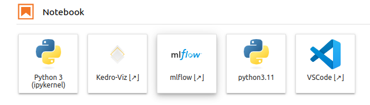

# Jupyter Images

This repository stores recipes of publicly-available Jupyter images

Latest versions:

```
gcr.io/getindata-images-public/jupyterlab-mlops:dev-0.2.9
```

## jupyterlab-base

Local copy of [jupyter/base-notebook](https://jupyter-docker-stacks.readthedocs.io/en/latest/using/selecting.html#jupyter-base-notebook),
used to build and manage local versions of `base-notebook` image that are no longer published in offical repositories:

### jupyterlab-base:ubuntu-20.04.python-3.8

* conda-backed python 3.8.x environment
* Ubuntu 20.04 as base image

## jupyterlab-mlops

### jupyterlab-mlops:dev

Based on the [jupyter/pyspark-notebook](https://jupyter-docker-stacks.readthedocs.io/en/latest/using/selecting.html#jupyter-pyspark-notebook)
image with additional setup of:

* conda-backed python 3.11 environment with [kedro 0.19.8](https://docs.kedro.org/en/0.19.8/) framework
* [jupyterlab-git](https://github.com/jupyterlab/jupyterlab-git) extension
* [jupyter-server-proxy](https://jupyter-server-proxy.readthedocs.io) extension
* local [MLflow](https://mlflow.org/) server for experiment tracking
* local [code-server](https://github.com/coder/code-server) as IDE accessed from the browser
* local [Spark 3.5.0](https://spark.apache.org/docs/3.5.0/) server for data analytics



Compatibility:

- [x] [JupyterHub](https://jupyter.org/hub)

### jupyterlab-mlops:python-3.11

Based on the [jupyter/minimal-notebook:python-3.11](https://jupyter-docker-stacks.readthedocs.io/en/latest/using/selecting.html#jupyter-minimal-notebook)
image with additional setup of:

* conda-backed python 3.11 environment with [kedro 0.19.8](https://docs.kedro.org/en/0.19.8/) framework
* [jupyterlab-git](https://github.com/jupyterlab/jupyterlab-git) extension
* [jupyter-server-proxy](https://jupyter-server-proxy.readthedocs.io) extension
* local [MLflow](https://mlflow.org/) server for experiment tracking
* local [code-server](https://github.com/coder/code-server) as IDE accessed from the browser


Compatibility:

- [x] [Kubeflow Notebook Servers](https://www.kubeflow.org/docs/components/notebooks/)
- [x] [JupyterHub](https://jupyter.org/hub)

## jupyterlab-dataops

Based on the [jupyter/minimal-notebook:python-3.11.4](https://hub.docker.com/layers/jupyter/minimal-notebook/python-3.11.4/images/sha256-1924d8d0adf9cf3646bf7fa3833a30e47d2b0a17a2b583556b37f015f208f115?context=explore)
image with additional setup:

- **jupyterhub-base** image
  - [jupyterlab-git](https://github.com/jupyterlab/jupyterlab-git) extension
- **snowflake** image
  - [jupyterlab-git](https://github.com/jupyterlab/jupyterlab-git) extension
  - [jupyter-server-proxy](https://jupyter-server-proxy.readthedocs.io) extension
  - local [code-server](https://github.com/coder/code-server) as IDE accessed from the browser with
  - [dbt Power User](https://marketplace.visualstudio.com/items?itemName=innoverio.vscode-dbt-power-user) extension pre-installed
  - [data-pipelines-cli](https://github.com/getindata/data-pipelines-cli)
  - [Snow SQL plugin](https://docs.snowflake.com/en/user-guide/snowsql)

Compatibility:

- [x] [JupyterHub](https://jupyter.org/hub)

## jupyterlab-streaming

Based on the [jupyter/base-notebook](https://jupyter-docker-stacks.readthedocs.io/en/latest/using/selecting.html#jupyter-base-notebook)
image with additional setup:

* conda-backed python 3.8.8 environment
* [jupyterlab-git](https://github.com/jupyterlab/jupyterlab-git) extension
* [jupyter-server-proxy](https://jupyter-server-proxy.readthedocs.io) extension
* [streaming-jupyter-integrations](https://github.com/getindata/streaming-jupyter-integrations) Jupyter magics for interactively running _Flink SQL_ jobs
* [streamingcli](https://github.com/getindata/streaming-cli) tool
* local [code-server](https://github.com/coder/code-server) as IDE

Compatibility:

- [x] [JupyterHub](https://jupyter.org/hub)

#### How to use this image?

In Kubeflow Notebooks select *Custom Image* checkbox and enter image location:


In Vertex AI select *New instace -> Customize instance*, then in *Environment* select *Custom container*.
Finally, enter image location in *Docker container image* input:


